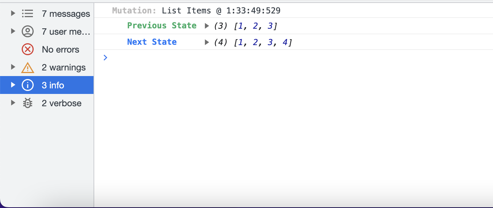
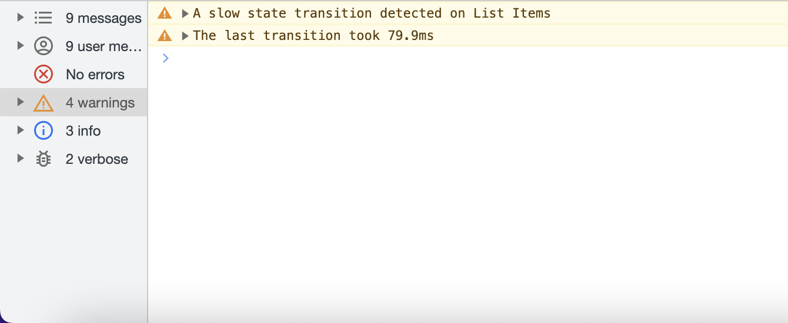

# Galena

Lightning fast, framework agnostic state, that doesn't glue your state operations to your UI components!

## Basic Usage

```typescript
import { State, createState } from "@figliolia/galena";

const myState = new State(/* any value */);
// or
const myState = createState(/* any value */);

const currentValue = myState.getSnapshot();
const subscriber = myState.subscribe(nextValue => {});
myState.set(/* new value */);
myState.update(previousValue => /* new value */);

// to reset state back to its original value
myState.reset();

// to unregister the subscription
subscriber();
```

## Installation

```
npm i @figliolia/galena
# with react
npm i @figliolia/react-galena
```

## Basic Usage

### The State Model

The instancable `State` object in Galena is a reactive wrapper around any value. You can use it to apply reactivity to large objects or simple values

```typescript
import { State } from "@figliolia/galena";

const MyState = new State(/* any value */, /* middleware */);

const subscriber = MyState.subscribe(value => {
  // do something with changed values
});

// to unsubscribe
subscriber();

MyState.set(/* new value */);
MyState.update(previousValue => /* new value */);
MyState.reset(); // reset state back to the initial value
```

Instances of `State` are ultimately what compose all reactivity in Galena. They can exist as islands compose larger stateful model.

### The Galena Model

`Galena` objects are designed to "link" multiple instances of `State` together to create a "global" application state.

To use it simply define your `State`'s and pass them to a `Galena` instance

```typescript
import { Galena, State } from "@figliolia/galena";

const AppState = new Galena(
  {
    navigation: new State({
      currentRoute: "/",
      navigationMenuOpen: false,
    }),
    user: new State({
      userID: "<id>",
      membershipTier: "free",
      friends: ["<id-1>", "<id-2>"],
    }),
    // ...and so on
  } /* middleware */,
);

// From here, operations on any slice of state are type-aware
// and operable via a single construct:
const subscriber = AppState.subscribe(
  ({
    state, // The entire state object at the time of change
    updated, // This individual State instance that was updated
  }) => {
    // react to state changes
  },
);

// to unsubscribe
subscriber();

// to access an instance of state
const UserState = AppState.get("user");
// to operate
UserState.update(state => /* next state */);
// or
AppState.update("user", state => /* next state */)
```

### Beyond the Basics

#### Modeling Data with Mutations

`State` in Galena is designed for extension and instancing - a need that ultimately motivated the library's development.

Let's take a look at a working example

```typescript
import { State } from "@figliolia/galena";

export class MyGameState extends State<IMyGameState> {
  constructor(
    public readonly playerID: string,
    initialState?: Partial<IMyGameState>,
  ) {
    super({
      // ...default values for state
      score: 0,
      level: 1,
      // overrides for the current instance
      ...initialState,
    });
  }

  public incrementScore(byAmount: number) {
    this.mutate(state => {
      state.score + byAmount,
    });
  }

  public goToNextLevel() {
    this.mutate(state => {
      state.level + 1,
    });
  }

  private mutate(fn: (state: IMyGameState) => void) {
    state.update(previous => {
      const clone = {...previous};
      fn(clone);
      return clone;
    })
  }
}
```

These more "robust" state models assist in standardizing a developer API along with your data models. The models you create are also compatible with your your `Galena` instances:

```typescript
import { Galena } from "@figliolia/galena";
import { MyGameState } from "./MyGameState";

const MyAppState = new Galena({
  player1: new MyGameState(),
  player2: new MyGameState(),
});

// Operate
MyAppState.get("player1").incrementScore(100);
MyAppState.get("player2").raiseLevel();
```

### Middleware

Middleware provides a developer API for building out custom tooling for your state.

Building middleware is as simple as extending `Galena`'s `Middleware` class and registering on your state.

Here's a quick example using the redux-like logger provided by this package:

```typescript
import { Middleware, type State } from "@figliolia/galena";

export class Logger<T = any> extends Middleware<T> {
  private previousState: T | null = null;

  override onBeforeUpdate(state: State<T>) {
    // capture the previous state before an update takes place
    this.previousState = state.getSnapshot();
  }

  override onUpdate(state: State<T>) {
    // Log the time of mutation
    console.log(
      "%cMutation:",
      "color: rgb(187, 186, 186); font-weight: bold",
      "@",
      this.time,
    );
    // Log the previous state
    console.log(
      "   %cPrevious State",
      "color: #26ad65; font-weight: bold",
      this.previousState,
    );
    // Log the new state
    console.log(
      "   %cNext State    ",
      "color: rgb(17, 118, 249); font-weight: bold",
      state.getSnapshot(),
    );
  }

  private get time() {
    const date = new Date();
    const mHours = date.getHours();
    const hours = mHours > 12 ? mHours - 12 : mHours;
    const mins = date.getMinutes();
    const minutes = mins.toString().length === 1 ? `0${mins}` : mins;
    const secs = date.getSeconds();
    const seconds = secs.toString().length === 1 ? `0${secs}` : secs;
    const milliseconds = date.getMilliseconds();
    return `${hours}:${minutes}:${seconds}:${milliseconds}`;
  }
}
```

Registering middleware is simple:

```typescript
import { Logger, Profiler } from "@figliolia/galena";

// To apply middleware to all instances of `State`
// attached to a `Galena` instance

const MyAppState = new Galena({
  // state
}, new Logger(), new Profiler());

// To apply middleware to a single piece of `State`
const MyState = new State(
  /* reactive value */,
  new Logger(),
  new Profiler()
);
```

In your console you'll now see logs like the following:

And Profiler warnings such as thing one


### Frameworks

With State management tools, naturally comes frontend frameworks. Galena provides bindings for `React` through
the [react-galena](https://github.com/alexfigliolia/react-galena) library
