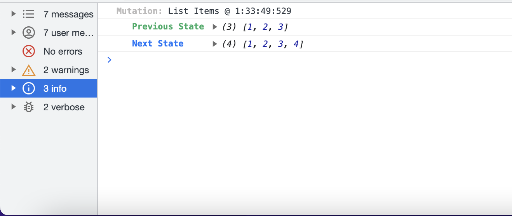
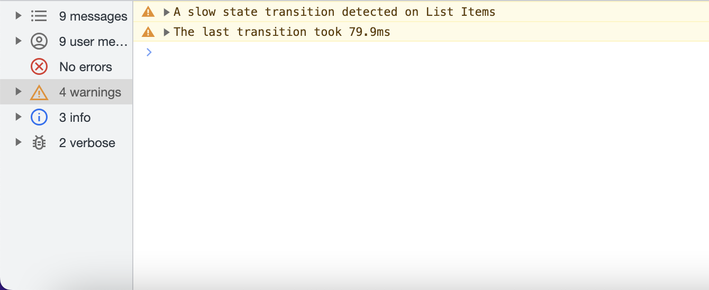

# Galena

Lightning fast, framework agnostic state, that doesn't glue your state operations to your UI components!

1. [State](#state)
2. [Galena](#galena)
3. [Extending State](#extending-state)
4. [Middleware](#middleware)
5. [For use with react](#frameworks)

## Installation

```
npm i @figliolia/galena
# with react
npm i @figliolia/react-galena
```

## Basic Usage

### State

`State` is a reactive wrapper around any value. It can be used in Vanilla JavaScript, within a UI framework, or even on the server.

```typescript
import { State, createState } from "@figliolia/galena";

const myState = new State(/* any value */);
// or
const myState = createState(/* any value */);

// Get the current value
const currentValue = myState.getState();

// Subscribe to changes
const subscriber = myState.subscribe(nextValue => {});

// Unregister the subscription
subscriber();

// Set new values
myState.set(/* new value */);
myState.update(previousValue => /* new value */);

// Reset back to its original value
myState.reset();
```

Instances of `State` compose all reactivity in Galena. They can exist in isolation or compose complex stateful models.

### Galena

`Galena` objects are designed to "link" multiple instances of `State` together to create a more complex stateful model

To use it simply define your `State`'s and pass them to a `Galena` instance

```typescript
import { Galena, State } from "@figliolia/galena";

const AppState = new Galena({
  navigation: new State({
    currentRoute: "/",
    navigationMenuOpen: false,
  }),
  user: new State({
    userID: "<id>",
    membershipTier: "free",
    friends: ["<id-1>", "<id-2>"],
  }),
  shoppingCart: new State({
    items: [],
    total: 0.0,
    lastUpdated: Date.now(),
  }),
});

// From here, operations on any slice of state are type-aware
// and operable via a single construct:
const subscriber = AppState.subscribe(
  ({
    state, // The entire state object at the time of change
    updated, // This individual State instance that was updated
  }) => {
    // Any callback you wish to run when state changes
  },
);

// to unsubscribe
subscriber();

// to access an instance of state
const UserState = AppState.get("user");
// to operate
UserState.update(state => /* next state */);
// or
AppState.update("user", state => /* next state */);

// to read the current value of the entire state tree
const state = AppState.getState();
```

### Extending State

`State` is designed for extension. With it, you can create robust reactivity models with mutations and collocated logic

```typescript
import { State } from "@figliolia/galena";

export class MyGameState extends State<IMyGameState> {
  constructor(
    public readonly playerID: string,
    initialState?: Partial<IMyGameState>,
  ) {
    super({
      // ...default values for state
      score: 0,
      level: 1,
      // overrides for the current instance
      ...initialState,
    });
  }

  public incrementScore(byAmount: number) {
    this.mutate(state => {
      state.score + byAmount,
    });
  }

  public goToNextLevel() {
    this.mutate(state => {
      state.level + 1,
    });
  }

  private mutate(fn: (state: IMyGameState) => void) {
    state.update(previous => {
      const clone = {...previous};
      fn(clone);
      return clone;
    })
  }
}
```

These more "robust" state models assist in standardizing a developer API along with your data models. The models you create are also compatible with your your `Galena` instances:

```typescript
import { Galena } from "@figliolia/galena";
import { MyGameState } from "./MyGameState";

const MyAppState = new Galena({
  player1: new MyGameState("<player1-id>"),
  player2: new MyGameState("<player2-id>"),
});

// Operate
MyAppState.get("player1").incrementScore(100);
MyAppState.get("player2").raiseLevel();
```

### Middleware

Middleware provides a developer API for building out custom tooling for your state.

Out of the box, this library comes with middleware for Logging and Profiling changes to your state.

The `Logger` is a redux-style logger that'll log state changes to the console.



The `Profiler` allows you to set a millisecond theshold, and will warn you any time a state update exceeds that threshold



#### Applying Middleware

Middleware can be applied to individual state instances or an entire Galena tree:

```typescript
import { Logger, Profiler } from "@figliolia/galena";

// To apply middleware to all instances of `State`
// attached to a `Galena` instance
const MyAppState = new Galena(
  { /* state tree */ },
  new Logger(),
  new Profiler()
);

// To apply middleware to a single piece of `State`
const MyState = new State(
  /* value */,
  new Logger(),
  new Profiler()
);
```

#### Building Your Own Middleware

To build your own middleware, extend the `Middleware` and override any of it's methods. Here's a quick example of how to build a redux-like logging middleware for your state:

```typescript
import { Middleware, type State } from "@figliolia/galena";

export class ReduxStyleLogger<T = any> extends Middleware<T> {
  private previousState: T | null = null;

  override onBeforeUpdate(state: State<T>) {
    // capture the previous state before an update takes place
    this.previousState = state.getState();
  }

  override onUpdate(state: State<T>) {
    // Log the time of mutation
    console.log(
      "%cMutation:",
      "color: rgb(187, 186, 186); font-weight: bold",
      "@",
      this.time,
    );
    // Log the previous state
    console.log(
      "   %cPrevious State",
      "color: #26ad65; font-weight: bold",
      this.previousState,
    );
    // Log the new state
    console.log(
      "   %cNext State    ",
      "color: rgb(17, 118, 249); font-weight: bold",
      state.getState(),
    );
  }

  private get time() {
    const date = new Date();
    const mHours = date.getHours();
    const hours = mHours > 12 ? mHours - 12 : mHours;
    const mins = date.getMinutes();
    const minutes = mins.toString().length === 1 ? `0${mins}` : mins;
    const secs = date.getSeconds();
    const seconds = secs.toString().length === 1 ? `0${secs}` : secs;
    const milliseconds = date.getMilliseconds();
    return `${hours}:${minutes}:${seconds}:${milliseconds}`;
  }
}
```

### Frameworks

With State management tools, naturally comes frontend frameworks. Galena provides bindings for `React` through
the [react-galena](https://github.com/alexfigliolia/react-galena) library
